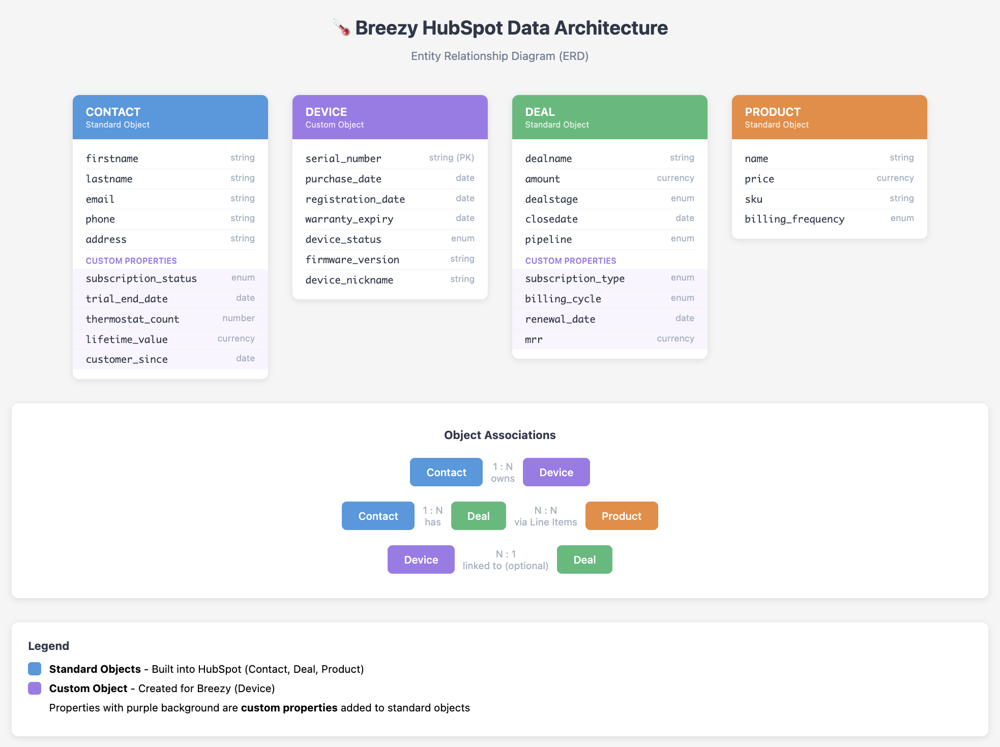

# Breezy HubSpot Integration POC

A proof-of-concept demonstrating HubSpot CRM integration for Breezy, a smart thermostat company, with AI-powered customer intelligence.

---

## Table of Contents

1. [Project Overview](#project-overview)
2. [Setup Instructions](#setup-instructions)
3. [Features](#features)
4. [HubSpot Data Architecture](#hubspot-data-architecture)
5. [AI Feature Deep Dive](#ai-feature-deep-dive)
6. [Design Decisions](#design-decisions)
7. [AI Usage Documentation](#ai-usage-documentation)
8. [API Reference](#api-reference)

---

## Project Overview

### Business Context

Breezy is a smart thermostat company that sells:
- **Hardware:** Smart thermostats at `$299` each
- **Subscription:** Breezy Premium service at `$9.99/month` or `$99/year`
- **Trial:** 30-day free trial included with every purchase

Breezy's marketing team will work in HubSpot and needs:
- Automated customer data sync from their e-commerce and subscription management systems
- Subscription lifecycle tracking (trial → conversion → renewals)
- Intelligence to identify expansion opportunities (additional thermostats, plan upgrades)

### What This POC Demonstrates

This application simulates the **admin panel** that would show integration mechanics to Breezy's operations team. In production, these events would happen automatically via webhooks and background jobs—but for demonstration purposes, this interface allows manual triggering.

**Key capabilities:**
- ✅ Customer registration sync to HubSpot **Contacts**
- ✅ Subscription conversion tracking via HubSpot **Deals**
- ✅ AI-powered customer analysis (health score, expansion opportunities)
- ✅ Privacy-first design (no PII sent to AI)

---

## Setup Instructions

### Prerequisites

- **Node.js** v18+ and npm
- **HubSpot Developer Account** with a test portal
- **OpenAI API Key** (for AI customer insights feature)

### 1. Install Dependencies

Install backend dependencies:

```bash
cd backend
npm install
```

Install frontend dependencies:

```bash
cd ../frontend
npm install
```

### 2. Get Your HubSpot Access Token

To connect to the HubSpot API, you'll need to create a Private App:

1. **Log into your HubSpot test portal** (or create one at [app.hubspot.com/signup-hubspot/crm](https://app.hubspot.com/signup-hubspot/crm))
2. Navigate to **Settings** (gear icon in top right) → **Integrations** → **Private Apps**
3. Click **Create a private app**
4. **Configure the app:**
   - **Name:** "Breezy Integration POC"
   - **Description:** "Integration for customer data sync and AI insights"
5. **Go to the Scopes tab** and enable these scopes:
   - `crm.objects.contacts.read` - Read contacts
   - `crm.objects.contacts.write` - Create/update contacts
   - `crm.objects.deals.read` - Read deals
   - `crm.objects.deals.write` - Create deals
6. Click **Create app**
7. Click **Show token** and copy the access token (starts with `pat-...`)

### 3. Get Your OpenAI API Key

1. Go to [platform.openai.com/api-keys](https://platform.openai.com/api-keys)
2. Sign in or create an account
3. Click **Create new secret key**
4. Copy the key (starts with `sk-...`)

> **Note:** The AI feature uses `GPT-4o-mini` which costs approximately `$0.15 per 1 million input tokens`. This POC should cost less than `$0.01 to test`.

### 4. Configure Environment Variables

Create a `.env` file in the `backend/` directory:

```bash
cd backend
cp .env.example .env
```

Edit `backend/.env` and add your tokens:

```bash
# HubSpot Private App Access Token
HUBSPOT_ACCESS_TOKEN=pat-eu1-your-token-here

# OpenAI API Key
OPENAI_API_KEY=sk-proj-your-key-here
```

The `.gitignore` file is configured to ignore `.env`

### 5. Start the Backend Server

From the project root, start the backend:

**Development mode (with auto-reload):**
```bash
cd backend
npm run dev
```

**OR Production mode:**
```bash
cd backend
npm start
```

You should see:
```
✅ Server running successfully!
🌐 API available at: http://localhost:3001
📋 Health check: http://localhost:3001/health
```

### 6. Start the Frontend (in a separate terminal)

From the project root:

```bash
cd frontend
npm run dev
```

You should see:
```
  VITE v5.x.x  ready in xxx ms

  ➜  Local:   http://localhost:5173/
  ➜  Network: use --host to expose
  ➜  press h + enter to show help
```

Open [http://localhost:5173](http://localhost:5173) in your browser.

### 7. Test the Integration

Test that the backend is running:

```bash
curl http://localhost:3001/health
```

Expected response:
```json
{"status":"Server is running","timestamp":"2025-01-12T..."}
```

Test HubSpot connectivity:

```bash
curl http://localhost:3001/api/contacts
```

If your token is valid, you'll receive a JSON response with your HubSpot contacts.

### Testing the Integration Flow

**End-to-end workflow:**

1. **Register a new customer**
   - Fill out the "New Thermostat Purchase" form
   - Click "Register & Sync to HubSpot"
   - Verify contact appears in HubSpot Contacts

2. **Record a conversion**
   - Use the "Trial → Paid Conversion" form
   - Select the customer you just created
   - Choose Annual or Monthly plan
   - Click "Record Conversion"
   - Verify deal appears in HubSpot Deals

3. **View sync status**
   - The table below shows all contacts synced to HubSpot
   - Click "Expand" on a contact to see their deals
   - View Total Revenue calculation

4. **Analyze customer with AI**
   - In the expanded contact view, click "✨ Analyze Customer"
   - See health score, expansion potential, and recommended actions
   - Note: Requires at least one deal to analyze

---

## Features

### A. Customer Data Sync

**What it does:** Simulates customer registration from Breezy's e-commerce system, creating a Contact in HubSpot.

**In production:** This would happen automatically when a customer purchases a thermostat (contact created with payment/shipping info)

**HubSpot object created:** Contact

**Properties synced:**
- First Name, Last Name
- Email, Phone
- Address

**Note:** Device registration would update the existing contact and create a Device custom object record (see [Data Architecture](#hubspot-data-architecture)), but for this POC we're simulating the initial contact creation.

### B. Subscription Tracking

**What it does:** Records trial-to-paid conversions as Deals in HubSpot.

**Business logic:**
- Monthly plan: $9.99 deal, stage = `closedwon`
- Annual plan: $99 deal, stage = `closedwon`
- Deals are associated with the Contact
- Multiple deals per customer are supported (renewals, upgrades)

**In production:** This would trigger:
- When a customer converts from trial to paid
- When a subscription renews (creates a new Deal)
- When a customer upgrades from monthly to annual

**HubSpot object created:** Deal (associated to Contact)

### C. AI-Powered Customer Insights

**What it does:** Analyzes customer transaction data to provide:
- **Health Score** (1-10): Customer engagement and subscription strength
- **Expansion Potential** (Low/Medium/High): Opportunity for upgrades (monthly→annual) or growth (additional thermostats)
- **Recommended Action**: Specific next step for sales/marketing
- **Marketing Angle**: Personalized messaging strategy

**Key insight:** The AI considers both upgrade potential (plan improvements) and growth potential (additional purchases). Heavy buyers with multiple thermostats are rated Medium (not Low) because past purchase behavior predicts future opportunities—they're prime candidates for referral programs and lifecycle expansions.

**Privacy approach:** Only anonymized transactional data is sent to OpenAI—no customer names, emails, or contact information. See [AI Feature Deep Dive](#ai-feature-deep-dive) for details.

---

## HubSpot Data Architecture

### Entity Relationship Diagram



### Object Architecture Overview

#### Objects Used

| Object | Type | Purpose |
|--------|------|---------|
| **Contact** | Standard | Represents each Breezy customer |
| **Device** | Custom | Represents each physical thermostat unit |
| **Deal** | Standard | Tracks subscription conversions and revenue |
| **Product** | Standard | Catalog of purchasable items (hardware + subscription tiers) |

#### Key Associations

```
Contact (1) ──────► (N) Device
    │                    │
    │                    │ (optional link)
    │                    ▼
    └──────► (N) Deal ◄──┘
                 │
                 └──► (N) Line Items ◄── Product
```

- **Contact → Device (1:N):** A customer can own multiple thermostats
- **Contact → Deal (1:N):** A customer can have multiple subscription transactions (renewals, upgrades)
- **Device → Deal (N:1, optional):** Links device registration to the original purchase deal
- **Deal → Product (N:N via Line Items):** Deals contain line items referencing products

### Recommended Properties

#### Contact (Standard Object + Custom Properties)

| Property | Type | Standard/Custom | Purpose |
|----------|------|-----------------|---------|
| `firstname` | String | Standard | Customer first name |
| `lastname` | String | Standard | Customer last name |
| `email` | String | Standard | Primary contact email |
| `phone` | String | Standard | Contact phone |
| `address` | String | Standard | Shipping/billing address |
| `subscription_status` | Enum | **Custom** | Values: `none`, `trial`, `active`, `churned`, `expired` |
| `trial_end_date` | Date | **Custom** | When 30-day trial expires (for automation triggers) |
| `thermostat_count` | Number | **Custom** | Rollup count of associated Device objects |
| `lifetime_value` | Currency | **Custom** | Rollup sum of all closed-won deals |
| `customer_since` | Date | **Custom** | Date of first thermostat registration |

#### Device (Custom Object)

| Property | Type | Purpose |
|----------|------|---------|
| `serial_number` | String (Primary) | Unique identifier for each thermostat |
| `purchase_date` | Date | When hardware was purchased |
| `registration_date` | Date | When customer registered device in Breezy app |
| `device_status` | Enum | Values: `purchased`, `registered`, `active`, `inactive`, `replaced` |
| `firmware_version` | String | Current firmware (for support segmentation) |
| `device_nickname` | String | Customer's label, e.g., "Living Room", "Upstairs" |

#### Deal (Standard Object + Custom Properties)

| Property | Type | Standard/Custom | Purpose |
|----------|------|-----------------|---------|
| `dealname` | String | Standard | e.g., "Breezy Premium - Annual Subscription" |
| `amount` | Currency | Standard | Transaction value |
| `dealstage` | Enum | Standard | Pipeline stage |
| `closedate` | Date | Standard | When deal closed |
| `pipeline` | Enum | Standard | Which pipeline (Subscription vs Hardware) |
| `subscription_type` | Enum | **Custom** | Values: `monthly`, `annual` |
| `billing_cycle` | Enum | **Custom** | Values: `one-time`, `recurring` |
| `renewal_date` | Date | **Custom** | Next renewal date (for renewal automation) |
| `mrr` | Currency | **Custom** | Monthly Recurring Revenue (normalized) |

#### Product (Standard Object)

| Product Name | SKU | Price | Billing Frequency |
|--------------|-----|-------|-------------------|
| Breezy Smart Thermostat | `THERM-001` | $299 | One-time |
| Breezy Premium - Monthly | `PREM-M` | $9.99 | Monthly |
| Breezy Premium - Annual | `PREM-A` | $99 | Annual |

### Deal Pipeline Architecture

#### Subscription Pipeline

This pipeline tracks the customer journey from trial to paid subscription:

```
┌─────────────┐   ┌─────────────┐   ┌─────────────┐   ┌─────────────┐   ┌─────────────┐
│   TRIAL     │ → │   TRIAL     │ → │ CONVERSION  │ → │  CLOSED     │   │  CLOSED     │
│  STARTED    │   │   ENDING    │   │  OFFERED    │   │    WON      │   │   LOST      │
│             │   │  (Day 23+)  │   │             │   │ (Converted) │   │ (Churned)   │
└─────────────┘   └─────────────┘   └─────────────┘   └─────────────┘   └─────────────┘
     │                  │                  │                 │                │
     │                  │                  │                 │                │
  Auto-created      Trigger:           Sales/            Success!         Win-back
  when device      automation         marketing                          campaign
  registered        outreach          engagement                          target
```

| Stage | Stage ID | Probability | Automation Trigger |
|-------|----------|-------------|-------------------|
| Trial Started | `trial_started` | 20% | Welcome email sequence |
| Trial Ending | `trial_ending` | 40% | Day 23: Conversion campaign triggered |
| Conversion Offered | `conversion_offered` | 60% | Discount offer sent |
| Closed Won | `closedwon` | 100% | Subscription activated, onboarding email |
| Closed Lost | `closedlost` | 0% | Add to win-back segment |

#### Why This Pipeline Structure?

1. **Trial Started** - Created automatically when a customer buys their thermostat. Starts the 30-day countdown.

2. **Trial Ending** - Automated trigger at Day 23 moves deals here. This is the key intervention window—7 days to convert.

3. **Conversion Offered** - Sales/marketing has actively engaged. Useful for tracking which outreach methods work.

4. **Closed Won/Lost** - Terminal states. Closed Won triggers subscription activation; Closed Lost triggers win-back workflows.

### Design Rationale

#### Why a Custom Object for Devices?

**Alternative considered:** Using Deals to track both hardware purchases and subscriptions.

**Why we chose Custom Object:**

1. **Accurate thermostat counts** - Marketing needs to identify "customers with 1 thermostat" for expansion campaigns. With a Device object, this is a simple rollup count. With Deals, you'd need complex filtering.

2. **Device lifecycle tracking** - Thermostats have their own lifecycle (warranty, firmware, status) independent of purchases. A Custom Object cleanly models this.

3. **Future-proofing** - Breezy may add other smart home devices (sensors, vents). The Device object can accommodate this with a `device_type` property.

4. **Clear association semantics** - "Contact owns Devices" is more intuitive than "Contact has hardware-type Deals."

#### Why Custom Properties on Contact vs. Separate Objects?

Properties like `subscription_status` and `thermostat_count` could theoretically live elsewhere, but placing them on Contact enables:

- **Easy list segmentation** - Filter contacts directly by subscription status
- **Personalization tokens** - Use in emails: "You have {thermostat_count} Breezy devices"
- **Reporting** - Contact-level dashboards without complex joins

#### Why Not Use Companies Object?

Breezy's B2C model means customers are individuals, not organizations. For the scope of this POC, we are not yet considering B2B.

---

## AI Feature Deep Dive

### The Feature: Customer Intelligence Analysis

The AI analysis feature examines customer transaction patterns to provide actionable insights for Breezy's sales and marketing teams.

**What it analyzes:**
- Number of deals (subscriptions)
- Total revenue generated
- Subscription types (monthly vs annual)
- Deal stages (active vs closed)

**What it returns:**
- **Health Score (1-10):** Measures customer engagement strength
  - 9-10: Active annual subscriber, high engagement
  - 7-8: Solid subscriber showing good engagement
  - 5-6: Baseline engagement, watching for churn signals
  - 3-4: At-risk customer
  - 1-2: Churned or likely to churn

- **Expansion Potential (Low/Medium/High):** Opportunity for upgrades or additional purchases
  - High: Monthly plan (upgrade to annual), single thermostat owners (expansion opportunity), or both
  - Medium: 2-3 thermostats + annual plan (direct expansion less urgent, but strong referral candidates), loyal heavy buyers (past behavior predicts future opportunities)
  - Low: Trial/churned customers (need retention first), very recent customers (too early to upsell), disengaged customers

- **Recommended Action:** Specific next step for the team
  - Example: "Contact within 48 hours to offer multi-room expansion package with 10% bundle discount"

- **Marketing Angle:** Personalized messaging strategy
  - Example: "Focus on comfort convenience: 'Never wake up to a cold bedroom again—add thermostats to all rooms'"

### Why This Approach

Breezy's stated business needs:
1. ✅ Identify expansion opportunities (multi-thermostat upsells)
2. ✅ Enable targeted marketing campaigns
3. ✅ Track customer lifetime value

**Why AI for this use case:**
- Nuanced pattern recognition across multiple data points
- Natural language recommendations that sales teams can act on immediately
- Adaptability as Breezy's product line evolves

### Privacy Considerations

**What we DON'T send to OpenAI:**
- ❌ Customer names
- ❌ Email addresses
- ❌ Phone numbers
- ❌ Physical addresses
- ❌ Any personally identifiable information

**What we DO send:**
- ✅ Number of deals
- ✅ Total revenue (anonymized)
- ✅ Subscription types (annual/monthly counts)
- ✅ Deal stages (active/closed status)

**Implementation:** See `frontend/src/components/ContactRow.jsx`, function `buildAnonymizedProfile()` (lines 51-84). This function explicitly strips PII before sending data to the AI endpoint.

**Example payload sent to AI:**
```json
{
  "totalDeals": 2,
  "totalRevenue": 108.99,
  "subscriptions": [
    { "plan": "monthly", "amount": 9.99, "stage": "closedwon" },
    { "plan": "annual", "amount": 99, "stage": "closedwon" }
  ],
  "hasMultipleSubscriptions": true,
  "currentPlanType": "annual",
  "annualSubscriptionCount": 1,
  "monthlySubscriptionCount": 1
}
```

---

## Design Decisions

### Technical Choices

#### React + Vite for Frontend

**Why:**
- Modern developer experience with fast hot-reload
- Smaller bundle size than Create React App
- Minimal configuration needed for a POC

#### Separate Frontend Folder with Proxy

**Why:**
- Clean separation of concerns (server vs UI)
- Easier to deploy separately in production (static hosting for frontend, Node.js server for backend)


#### Expandable Table Rows

**Why:**
- Keeps context visible (you can see all customers and expand the ones you care about)
- One-page overview keeps the functionality in view and signals ease of use

**Alternative considered:** Separate detail page for each contact, but this would require more navigation and lose context.

#### AI Prompt in External File

**Why:**
- The OpenAI prompt is 80+ lines and contains important business logic
- Separating it into `prompts/customerAnalysisPrompt.js` makes it easier to:
  - Version control prompt changes separately
  - Test different prompt variations
  - Reuse the prompt in other contexts (CLI tools, batch jobs)
- Keeps `server.js` focused on API routing

### Assumptions About Breezy

These assumptions were made to scope the POC. In a real engagement, these would be validated with the client:

1. **Per-account subscription billing**
   - Assumption: A customer with 3 thermostats pays one subscription fee (not per-device billing)
   - Impact: Expansion revenue comes from selling more hardware + increasing account-level subscription value

2. **Device registration happens after purchase**
   - Assumption: Customer buys thermostat → receives it → registers in app
   - Impact: Registration triggers trial start; there's a gap between purchase and trial

3. **Marketing team primarily works in HubSpot**
   - Assumption: Sales/marketing don't need a separate dashboard; HubSpot is their workspace
   - Impact: Justifies building integrations vs. standalone tools

4. **New deals track subscription lifecycle events**
   - Assumption: Trial conversions, upgrades, and renewals create new deal records (not updates to existing deals)
   - Impact: Deal history shows full customer journey; total revenue is sum of all deals

### What I'd Improve with More Time

#### 1. Real-Time Sync Status Indicators
**Current state:** Users manually click "Refresh" to see updated data.

**Improvement:** Add WebSocket connection or polling to show live sync status. Display badges like "Syncing..." or "Last synced 2 minutes ago."

**Why it matters:** In production, operations teams need confidence that data is current, especially when troubleshooting sync issues.

---

#### 2. Bi-Directional Sync with Webhooks
**Current state:** Data flows one way (Breezy → HubSpot).

**Improvement:** Implement HubSpot webhook receiver to sync changes back:
- Marketing updates contact info in HubSpot → reflects in Breezy's database
- Sales manually closes a deal → triggers subscription activation in Breezy's billing system

**Why it matters:** True integration means both systems stay in sync. Prevents data drift.

---

#### 3. Bulk Import Functionality
**Current state:** POC only handles individual contact creation.

**Improvement:** Add CSV upload feature for migrating historical customers:
- Upload CSV with columns: `firstName`, `lastName`, `email`, `purchaseDate`, `subscriptionType`
- Validate data before creating HubSpot records
- Show progress bar for large imports
- Email summary report when complete

**Why it matters:** Breezy likely has existing customers. Migration is critical for rollout.

---

#### 4. More Sophisticated AI Analysis

**Current state:** AI analyzes current snapshot of customer data.

**Improvements:**

a) **Historical trend analysis**
   - Track changes in health score over time
   - Identify customers whose health is declining (churn risk)
   - Example: "Health score dropped from 8 to 5 in last 30 days"

b) **Cohort comparison**
   - Compare customer to similar cohorts (e.g., "customers who signed up in Q1 2024")
   - Identify outliers: "This customer's engagement is 40% below their cohort average"

c) **Predictive churn modeling**
   - Train on historical data: which customers churned and what signals preceded it
   - Generate churn risk score (independent of health score)

d) **Automated action triggers**
   - If expansion potential = High AND health score > 7 → auto-create task for sales rep
   - If health score < 4 → automatically add to win-back campaign in HubSpot workflows

**Why it matters:** Moves from reactive insights to proactive automation.

---

#### 5. Error Handling & Retry Logic
**Current state:** If HubSpot API call fails, operation fails.

**Improvements:**
- Implement exponential backoff retry (3 attempts)
- Queue failed operations for manual review
- Add monitoring/alerting when sync failure rate exceeds threshold
- Detailed error logging with request IDs for debugging

**Why it matters:** Production integrations must be resilient to transient network issues.

---

#### 6. Device Object Implementation
**Current state:** POC only implements Contacts and Deals.

**Improvement:** Fully implement the Device custom object (see ERD):
- Create Device records when thermostats are registered
- Associate Devices with Contacts (1:N relationship)
- Track device status, firmware version, warranty
- Use device count for expansion segmentation

**Why it matters:** This is where the most valuable expansion insights come from—knowing who has 1 thermostat vs. 3.

---

#### 7. Automated Testing
**Current state:** Manual testing only.

**Improvements:**
- Unit tests for anonymization logic (ensure no PII leaks)
- Integration tests for HubSpot API calls (using test portal)
- End-to-end tests with Playwright for critical flows
- CI/CD pipeline to run tests on every commit

**Why it matters:** Protects against regressions, especially for privacy-critical code.

---

#### 8. Multi-Environment Configuration
**Current state:** Single `.env` file.

**Improvement:**
- `.env.development` (HubSpot sandbox portal)
- `.env.staging` (HubSpot test portal with production-like data)
- `.env.production` (live HubSpot portal)
- Environment-specific feature flags (e.g., disable AI in dev to save costs)

**Why it matters:** Safe testing without risking production data.

### Questions for Client Before Production Implementation

1. **Device registration flow** - Does every purchased thermostat get registered? Or can customers buy without registering? This affects when Device records are created.

2. **Subscription per device or per account?** - Does one Premium subscription cover all of a customer's thermostats, or is it per-device? This affects Deal structure.

3. **Historical data migration** - How much historical purchase/subscription data needs to be migrated? This impacts initial sync architecture.

4. **Renewal handling** - Should renewals create new Deals or update existing ones? New Deals = cleaner revenue tracking; Updates = simpler timeline view.

5. **Multi-user households** - Can multiple people (e.g., spouses) have access to the same thermostat? If so, do we need a Contact-to-Contact association?


6. **Sales team workflow** - Should high-value expansion opportunities auto-create tasks for sales reps, or just appear in a list for them to manually review?

7. **Data retention** - How long should we keep data for churned customers? Impact on HubSpot storage costs and compliance (GDPR/CCPA).

---

## AI Usage Documentation

### Tools Used

**Primary AI tool:** Claude (Anthropic) via Claude Code CLI

**Model:** Claude 3.5 Sonnet

**Tasks AI helped with (with much human intervention):**

1. **Planning & Architecture**
   - Designed the component structure (ConversionForm, ContactRow, etc.)
   - Advised on HubSpot object model (Contacts, Deals, custom Device object)
   - Designed the ERD and data architecture

2. **Code Generation**
   - Wrote initial boilerplate for Express server expansion and React components
   - Implemented HubSpot API integration (authentication, error handling)
   - Created the privacy-preserving anonymization logic 

3. **OpenAI Prompt Engineering**
   - Drafted the customer analysis system prompt
   - Refined it through multiple human-in-the-loop iterations to improve output quality
   - Added business context (pricing, expansion priorities) to prompt

4. **Documentation**
   - Structured this README based on assignment requirements
   - Wrote the HubSpot Data Architecture document

5. **Consultative Thinking**
   - Helped formulate questions for the client (e.g., "subscription per device or per account?")
   - Identified edge cases (multi-user households, historical data migration)
   - Suggested future improvements (webhooks, bulk import, predictive churn)

**Quality improvements:**

- **Consultative depth:** AI helped me to focus less on code implementation and focus more intently on client needs and desired results
- **Code consistency:** AI maintained consistent error handling patterns across all API endpoints, quick iteration for other changes
- **Documentation:** AI helped generate comprehensive docs that would have taken much longer to implement manually
- 
### Challenges Encountered

- Much human-in-the-loop intervention was needed throughout the process - inconsistencies were generated in especially the business use cases that needed to be reconsidered.
- AI often wants to be "too helpful", making things overly complex or long-winded, which can distract from the essentials. 

**Where human judgment was critical:**

- Deciding NOT to auto-close existing deals when creating new ones (AI suggested it, but I realized it likely didn't fit Breezy's model)
- Choosing the right HubSpot object model (AI proposed alternatives; I selected based on scalability)
- Data privacy was not considered by AI (which data to send to OpenAI), I brought in this concern, and had AI implement the anonymization
- The original OpenAI prompt generated by Claude was very basic and didn't include much business context. It also falsely identified customers with multiple thermostats as "low" expansion potential. After multiple iterations, the prompt and results align better with Breezy's use case

### What I Learned

This was a fun assignment that gave me insight into the kind of integration work I could expect from a role as Solution Architect at Hubspot. I learned how to think about the data architecture critically from the customer's perspective, considering different options. It was also an insightful interaction with the AI assistant, which sped up development work but often introduced unwanted complexity. Overall very fun and I look forward to your feedback!


---

## API Reference

### Backend Server (http://localhost:3001)

| Endpoint | Method | Purpose |
|----------|--------|---------|
| `/health` | GET | Health check |
| `/api/contacts` | GET | Fetch all contacts from HubSpot |
| `/api/contacts` | POST | Create new contact in HubSpot |
| `/api/contacts/:contactId/deals` | GET | Fetch deals for a specific contact |
| `/api/deals` | GET | Fetch all deals from HubSpot |
| `/api/deals` | POST | Create new deal and associate to contact |
| `/api/ai/analyze` | POST | Analyze customer with AI (requires OpenAI key) |

### Example Request: Create Contact

```bash
POST /api/contacts
Content-Type: application/json

{
  "properties": {
    "firstname": "Jane",
    "lastname": "Doe",
    "email": "jane.doe@example.com",
    "phone": "+1-555-123-4567",
    "address": "123 Main St, Austin, TX 78701"
  }
}
```

### Example Request: Create Deal

```bash
POST /api/deals
Content-Type: application/json

{
  "dealProperties": {
    "dealname": "Breezy Premium - Annual Subscription",
    "amount": "99",
    "dealstage": "closedwon"
  },
  "contactId": "12345678"
}
```

### Example Request: AI Analysis

```bash
POST /api/ai/analyze
Content-Type: application/json

{
  "customerProfile": {
    "totalDeals": 1,
    "totalRevenue": 99,
    "subscriptions": [
      {
        "plan": "annual",
        "amount": 99,
        "stage": "closedwon"
      }
    ],
    "hasMultipleSubscriptions": false,
    "currentPlanType": "annual",
    "annualSubscriptionCount": 1,
    "monthlySubscriptionCount": 0
  }
}
```

---

## Project Structure

```
hs-solution-architect-tech-assignment/
├── backend/                           # Backend server
│   ├── server.js                      # Express backend server
│   ├── prompts/
│   │   └── customerAnalysisPrompt.js  # OpenAI system prompt (external)
│   ├── package.json                   # Backend dependencies
│   ├── .env                           # Environment variables (create this)
│   └── .env.example                   # Environment variables template
├── frontend/                          # React frontend
│   ├── src/
│   │   ├── App.jsx                    # Main React component
│   │   ├── components/
│   │   │   ├── Header.jsx             # App header
│   │   │   ├── CustomerEventsSection.jsx
│   │   │   ├── NewCustomerForm.jsx    # Contact creation form
│   │   │   ├── ConversionForm.jsx     # Deal creation form
│   │   │   ├── SyncStatusSection.jsx
│   │   │   ├── ContactsTable.jsx      # Table of synced contacts
│   │   │   └── ContactRow.jsx         # Expandable row with deals + AI
│   │   └── styles/
│   │       └── App.css                # HubSpot-inspired styling
│   ├── vite.config.js                 # Vite config with proxy
│   └── package.json                   # Frontend dependencies
├── docs/
│   ├── breezy-erd.png                 # ERD diagram (visual)
│   └── breezy-erd.html                # Interactive ERD
└── README.md                          # This file
```

---

## License

This is a proof-of-concept project created for the HubSpot Solutions Architect Technical Assessment. Not intended for production use.

---